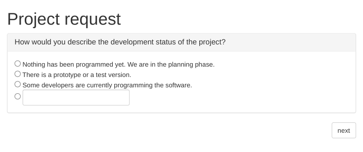
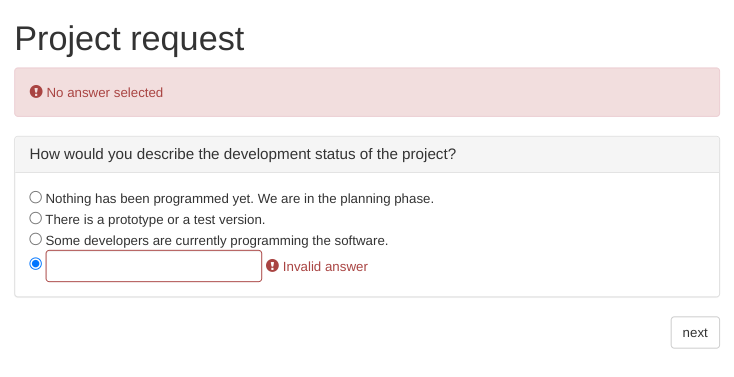

# Java Feedback Suite
This is still a very basic online survey tool written in Java.

## Features

 * Supports single and multiple choice questions with free text answers
 * Multiple surveys with multiple pages
 * As many questions as needed per page
 * Mandatory questions
 * Free text answer validation
 * Multilingual
 

## Technology

 * Spring Framework, Hibernate, Maven
 * JUnit, Mockito, JUnitParams
 * JSP, Apache Tiles, Bootstrap, jQuery

## Screenshots





## Installation

### Maven

~/.m2/settings.xml
```
<settings xmlns="https://maven.apache.org/SETTINGS/1.0.0"
      xmlns:xsi="https://www.w3.org/2001/XMLSchema-instance"
      xsi:schemaLocation="https://maven.apache.org/SETTINGS/1.0.0
                          https://maven.apache.org/xsd/settings-1.0.0.xsd">
<servers>
      <server>
        <id>tomcat</id>
        <username>admin</username>
        <password>password</password>
      </server>
</servers>
</settings>
```
#### Deploy
```
docker-compose up -d
```
```
mvn tomcat7:deploy
```
## Test your installation

* [Demo survey](http://localhost:8080/feedback-suite/survey/1/1)